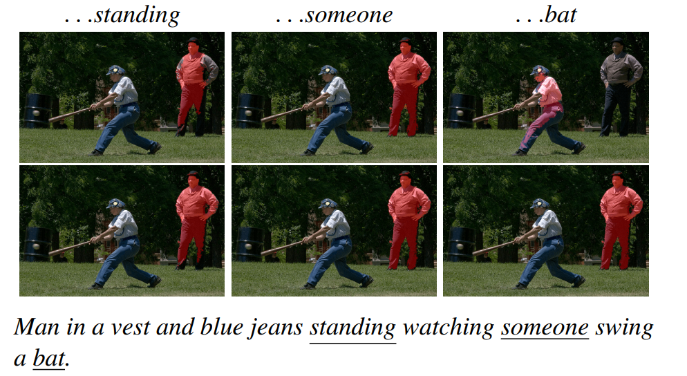

# Awesome-Referring-Image-Segmentation

A collection of referring image segmentation papers and datasets.

> Feel free to create a PR or an issue.

**Outline**

- [Awesome-Referring-Image-Segmentation](#awesome-referring-image-segmentation)
  - [1. Datasets](#1-datasets)
  - [2. Traditional Referring Image Segmentation](#2-traditional-referring-image-segmentation)
  - [3. Interactive Referring Image Segmentation](#3-interactive-referring-image-segmentation)
  - [4. Referring Video Object Segmentation](#4-referring-video-object-segmentation)
  - [5. Referring 3D Instance Segmentation](#5-referring-3d-instance-segmentation)

## 1. Datasets

| Short name | Paper | Source | Code/Project Link  |
| --- | --- | --- | --- |
| ReferIt | [Referit game: Referring to objects in photographs of natural scenes](https://aclanthology.org/D14-1086.pdf) | EMNLP 2014 | [[project]](http://tamaraberg.com/referitgame/) |
| Google-Ref | [Generation and comprehension of unambiguous object descriptions](https://openaccess.thecvf.com/content_cvpr_2016/papers/Mao_Generation_and_Comprehension_CVPR_2016_paper.pdf) | CVPR 2016 | [[dataset]](https://github.com/mjhucla/Google_Refexp_toolbox) |
| UNC | [Modeling context in referring expressions](https://arxiv.org/pdf/1608.00272.pdf) | ECCV 2016 | [[dataset]](https://github.com/lichengunc/refer) |
| UNC+ | [Modeling context in referring expressions](https://arxiv.org/pdf/1608.00272.pdf) | ECCV 2016 | [[dataset]](https://github.com/lichengunc/refer) |
| CLEVR-Ref+ | [CLEVR-Ref+: Diagnosing Visual Reasoning with Referring Expressions](https://openaccess.thecvf.com/content_CVPR_2019/papers/Liu_CLEVR-Ref_Diagnosing_Visual_Reasoning_With_Referring_Expressions_CVPR_2019_paper.pdf) | CVPR 2019 | [[project]](https://cs.jhu.edu/~cxliu/2019/clevr-ref+) |
| VGPhraseCut | [PhraseCut: Language-based Image Segmentation in the Wild](https://openaccess.thecvf.com/content_CVPR_2020/papers/Wu_PhraseCut_Language-Based_Image_Segmentation_in_the_Wild_CVPR_2020_paper.pdf) | CVPR 2020 | [[project]](https://people.cs.umass.edu/~chenyun/phrasecut/) |
| ScanRefer | [ScanRefer: 3D Object Localization in RGB-D Scans using Natural Language](https://www.ecva.net/papers/eccv_2020/papers_ECCV/papers/123650205.pdf) | ECCV 2020 | [[project]](https://daveredrum.github.io/ScanRefer/) |
| ClevrTex | [ClevrTex: A Texture-Rich Benchmark for Unsupervised Multi-Object Segmentation](https://datasets-benchmarks-proceedings.neurips.cc/paper/2021/file/e2c420d928d4bf8ce0ff2ec19b371514-Paper-round2.pdf) | NeurIPS Datasets and Benchmarks 2021 | [[project]](https://www.robots.ox.ac.uk/~vgg/data/clevrtex/) |
| gRefCOCO | [GRES: Generalized Referring Expression Segmentation](https://openaccess.thecvf.com/content/CVPR2023/papers/Liu_GRES_Generalized_Referring_Expression_Segmentation_CVPR_2023_paper.pdf) | CVPR 2023 | [[dataset]](https://github.com/henghuiding/gRefCOCO) [[project]](https://henghuiding.github.io/GRES/) |
| MeViS | [MeViS: A Large-scale Benchmark for Video Segmentation with Motion Expressions](https://arxiv.org/abs/2308.08544) | ICCV 2023 | [[dataset]](https://github.com/henghuiding/MeViS) [[project]](https://henghuiding.github.io/MeViS/) |

---

## 2. Traditional Referring Image Segmentation

| Short name | Paper | Source | Code/Project Link  |
| --- | --- | --- | --- |
| LISA | [LISA: Reasoning Segmentation via Large Language Model](https://arxiv.org/pdf/2308.00692.pdf) | arXiv 23.08 | [[code]](https://github.com/dvlab-research/LISA) |
| BKINet | [Bilateral Knowledge Interaction Network for Referring Image Segmentation](https://ieeexplore.ieee.org/abstract/document/10227590) | TMM 2023 | [[code]](https://github.com/dhding/BKINet) |
| TRIS | [Referring Image Segmentation Using Text Supervision](https://arxiv.org/abs/2308.14575) | ICCV 2023 | [[code]](https://github.com/fawnliu/TRIS) |
| RIS-DMMI | [Beyond One-to-One: Rethinking the Referring Image Segmentation](https://arxiv.org/abs/2308.13853) | ICCV 2023 | [[code]](https://github.com/toggle1995/RIS-DMMI) |
| ETRIS | [Bridging Vision and Language Encoders: Parameter-Efficient Tuning for Referring Image Segmentation](https://arxiv.org/pdf/2307.11545.pdf) | ICCV 2023 | [[code]](https://github.com/kkakkkka/ETRIS) |
| SEEM | [Segment Everything Everywhere All at Once](https://arxiv.org/pdf/2304.06718.pdf) | arXiv 23.04 | [[code]](https://github.com/UX-Decoder/Segment-Everything-Everywhere-All-At-Once) |
| SLViT | [SLViT: Scale-Wise Language-Guided Vision Transformer for Referring Image Segmentation](https://www.ijcai.org/proceedings/2023/0144.pdf) | IJCAI 2023 | [[code]](https://github.com/NaturalKnight/SLViT) |
| WiCo | [WiCo: Win-win Cooperation of Bottom-up and Top-down Referring Image Segmentation](https://www.ijcai.org/proceedings/2023/0071.pdf) | IJCAI 2023 |  |
| M3Att | [Multi-Modal Mutual Attention and Iterative Interaction for Referring Image Segmentation](https://ieeexplore.ieee.org/abstract/document/10132374) | TIP 2023 |  |
| X-Decoder | [X-Decoder: Generalized Decoding for Pixel, Image and Language](https://openaccess.thecvf.com/content/CVPR2023/papers/Zou_Generalized_Decoding_for_Pixel_Image_and_Language_CVPR_2023_paper.pdf) | CVPR 2023 | [[code]](https://github.com/microsoft/X-Decoder) [[project]](https://x-decoder-vl.github.io/) |
| Partial-RES | [Learning to Segment Every Referring Object Point by Point](https://openaccess.thecvf.com/content/CVPR2023/papers/Qu_Learning_To_Segment_Every_Referring_Object_Point_by_Point_CVPR_2023_paper.pdf) | CVPR 2023 | [[code]](https://github.com/qumengxue/Partial-RES) |
| MCRES | [Meta Compositional Referring Expression Segmentation](https://openaccess.thecvf.com/content/CVPR2023/papers/Xu_Meta_Compositional_Referring_Expression_Segmentation_CVPR_2023_paper.pdf) | CVPR 2023 |  |
| Global-Local CLIP | [Zero-shot Referring Image Segmentation with Global-Local Context Features](https://openaccess.thecvf.com/content/CVPR2023/papers/Yu_Zero-Shot_Referring_Image_Segmentation_With_Global-Local_Context_Features_CVPR_2023_paper.pdf) | CVPR 2023 | [[code]](https://github.com/Seonghoon-Yu/Zero-shot-RIS) |
| PolyFormer | [PolyFormer: Referring Image Segmentation as Sequential Polygon Generation](https://openaccess.thecvf.com/content/CVPR2023/papers/Liu_PolyFormer_Referring_Image_Segmentation_As_Sequential_Polygon_Generation_CVPR_2023_paper.pdf) | CVPR 2023 | [[code]](https://github.com/amazon-science/polygon-transformer) [[project]](https://polyformer.github.io/) |
| GRES | [GRES: Generalized Referring Expression Segmentation](https://openaccess.thecvf.com/content/CVPR2023/papers/Liu_GRES_Generalized_Referring_Expression_Segmentation_CVPR_2023_paper.pdf) | CVPR 2023 | [[code]](https://github.com/henghuiding/ReLA) [[dataset]](https://github.com/henghuiding/gRefCOCO) [[project]](https://henghuiding.github.io/GRES/) |
| CGFormer | [Contrastive Grouping with Transformer for Referring Image Segmentation](https://openaccess.thecvf.com/content/CVPR2023/papers/Tang_Contrastive_Grouping_With_Transformer_for_Referring_Image_Segmentation_CVPR_2023_paper.pdf) | CVPR 2023 | [[code]](https://github.com/Toneyaya/CGFormer) |
| SADLR | [Semantics-Aware Dynamic Localization and Refinement for Referring Image Segmentation](https://ojs.aaai.org/index.php/AAAI/article/view/25428/25200) | AAAI 2023 |  |
| R-RIS | [Towards Robust Referring Image Segmentation](https://arxiv.org/pdf/2209.09554.pdf) | arXiv 22.09 | [[code]](https://github.com/jianzongwu/robust-ref-seg) [[project]](https://lxtgh.github.io/project/robust_ref_seg/) |
| - | [Learning From Box Annotations for Referring Image Segmentation](https://ieeexplore.ieee.org/abstract/document/9875225) | TNNLS 2022 | [[code]](https://github.com/fengguang94/Weakly-Supervised-RIS) |
| - | [Instance-Specific Feature Propagation for Referring Segmentation](https://ieeexplore.ieee.org/abstract/document/9745353) | TMM 2022 |  |
| LAVT | [LAVT: Language-Aware Vision Transformer for Referring Image Segmentation](https://openaccess.thecvf.com/content/CVPR2022/papers/Yang_LAVT_Language-Aware_Vision_Transformer_for_Referring_Image_Segmentation_CVPR_2022_paper.pdf) | CVPR 2022 | [[code]](https://github.com/yz93/LAVT-RIS) |
| CRIS | [CRIS: CLIP-Driven Referring Image Segmentation](https://openaccess.thecvf.com/content/CVPR2022/papers/Wang_CRIS_CLIP-Driven_Referring_Image_Segmentation_CVPR_2022_paper.pdf) | CVPR 2022 | [[code]](https://github.com/DerrickWang005/CRIS.pytorch) |
| ReSTR | [ReSTR: Convolution-free Referring Image Segmentation Using Transformers](https://openaccess.thecvf.com/content/CVPR2022/papers/Kim_ReSTR_Convolution-Free_Referring_Image_Segmentation_Using_Transformers_CVPR_2022_paper.pdf) | CVPR 2022 | [[project]](http://cvlab.postech.ac.kr/research/restr/) |
| TV-Net | [Two-stage Visual Cues Enhancement Network for Referring Image Segmentation](https://dl.acm.org/doi/abs/10.1145/3474085.3475222) | ACM MM 2021 | [[code]](https://github.com/sxjyjay/tv-net) |
| VLT | [Vision-Language Transformer and Query Generation for Referring Segmentation](https://openaccess.thecvf.com/content/ICCV2021/papers/Ding_Vision-Language_Transformer_and_Query_Generation_for_Referring_Segmentation_ICCV_2021_paper.pdf) | ICCV 2021 | [[code]](https://github.com/henghuiding/Vision-Language-Transformer) |
| MDETR | [MDETR - Modulated Detection for End-to-End Multi-Modal Understanding](https://openaccess.thecvf.com/content/ICCV2021/papers/Kamath_MDETR_-_Modulated_Detection_for_End-to-End_Multi-Modal_Understanding_ICCV_2021_paper.pdf) | ICCV 2021 | [[code]](https://github.com/ashkamath/mdetr) [[project]](https://ashkamath.github.io/mdetr_page/) |
| CEFNet | [Encoder Fusion Network with Co-Attention Embedding for Referring Image Segmentation](https://openaccess.thecvf.com/content/CVPR2021/papers/Feng_Encoder_Fusion_Network_With_Co-Attention_Embedding_for_Referring_Image_Segmentation_CVPR_2021_paper.pdf) | CVPR 2021 | [[code]](https://github.com/fengguang94/CEFNet) |
| BUSNet | [Bottom-Up Shift and Reasoning for Referring Image Segmentation](https://openaccess.thecvf.com/content/CVPR2021/papers/Yang_Bottom-Up_Shift_and_Reasoning_for_Referring_Image_Segmentation_CVPR_2021_paper.pdf) | CVPR 2021 | [[code]](https://github.com/incredibleXM/BUSNet) |
| LTS | [Locate then Segment: A Strong Pipeline for Referring Image Segmentation](https://openaccess.thecvf.com/content/CVPR2021/papers/Jing_Locate_Then_Segment_A_Strong_Pipeline_for_Referring_Image_Segmentation_CVPR_2021_paper.pdf) | CVPR 2021 |  |
| CGAN | [Cascade Grouped Attention Network for Referring Expression Segmentation](https://dl.acm.org/doi/abs/10.1145/3394171.3414006) | ACM MM 2020 |  |
| LSCM | [Linguistic Structure Guided Context Modeling for Referring Image Segmentation](https://www.ecva.net/papers/eccv_2020/papers_ECCV/papers/123550052.pdf) | ECCV 2020 | [[code]](https://github.com/spyflying/LSCM-Refseg) |
| CMPC-Refseg | [Referring Image Segmentation via Cross-Modal Progressive Comprehension](https://openaccess.thecvf.com/content_CVPR_2020/papers/Huang_Referring_Image_Segmentation_via_Cross-Modal_Progressive_Comprehension_CVPR_2020_paper.pdf) | CVPR 2020 | [[code]](https://github.com/spyflying/CMPC-Refseg) |
| BRINet | [Bi-directional Relationship Inferring Network for Referring Image Segmentation](https://openaccess.thecvf.com/content_CVPR_2020/papers/Hu_Bi-Directional_Relationship_Inferring_Network_for_Referring_Image_Segmentation_CVPR_2020_paper.pdf) | CVPR 2020 | [[code]](https://github.com/fengguang94/CVPR2020-BRINet) |
| PhraseCut | [PhraseCut: Language-based Image Segmentation in the Wild](https://people.cs.umass.edu/~smaji/papers/phrasecut+supp-cvpr20.pdf) | CVPR 2020 | [[code]](https://github.com/ChenyunWu/PhraseCutDataset) [[project]](https://people.cs.umass.edu/~chenyun/phrasecut/) |
| MCN | [Multi-task Collaborative Network for Joint Referring Expression Comprehension and Segmentation](https://openaccess.thecvf.com/content_CVPR_2020/papers/Luo_Multi-Task_Collaborative_Network_for_Joint_Referring_Expression_Comprehension_and_Segmentation_CVPR_2020_paper.pdf) | CVPR 2020 | [[code]](https://github.com/luogen1996/MCN) |
| - | [Dual Convolutional LSTM Network for Referring Image Segmentation](https://ieeexplore.ieee.org/abstract/document/8978485/) | TMM 2020 |  |
| STEP | [See-Through-Text Grouping for Referring Image Segmentation](https://openaccess.thecvf.com/content_ICCV_2019/papers/Chen_See-Through-Text_Grouping_for_Referring_Image_Segmentation_ICCV_2019_paper.pdf) | ICCV 2019 |  |
| lang2seg | [Referring Expression Object Segmentation with Caption-Aware Consistency](https://bmvc2019.org/wp-content/uploads/papers/0196-paper.pdf) | BMVC 2019 | [[code]](https://github.com/wenz116/lang2seg) |
| CMSA | [Cross-Modal Self-Attention Network for Referring Image Segmentation](https://openaccess.thecvf.com/content_CVPR_2019/papers/Ye_Cross-Modal_Self-Attention_Network_for_Referring_Image_Segmentation_CVPR_2019_paper.pdf) | CVPR 2019 | [[code]](https://github.com/lwye/CMSA-Net) |
| KWA | [Key-Word-Aware Network for Referring Expression Image Segmentation](https://openaccess.thecvf.com/content_ECCV_2018/papers/Hengcan_Shi_Key-Word-Aware_Network_for_ECCV_2018_paper.pdf) | ECCV 2018 | [[code]](https://github.com/shihengcan/key-word-aware-network-pycaffe) |
| DMN | [Dynamic Multimodal Instance Segmentation Guided by Natural Language Queries](https://openaccess.thecvf.com/content_ECCV_2018/papers/Edgar_Margffoy-Tuay_Dynamic_Multimodal_Instance_ECCV_2018_paper.pdf) | ECCV 2018 | [[code]](https://github.com/BCV-Uniandes/DMS) |
| RRN | [Referring Image Segmentation via Recurrent Refinement Networks](https://openaccess.thecvf.com/content_cvpr_2018/papers/Li_Referring_Image_Segmentation_CVPR_2018_paper.pdf) | CVPR 2018 | [[code]](https://github.com/liruiyu/referseg_rrn) |
| MAttNet | [MAttNet: Modular Attention Network for Referring Expression Comprehension](https://openaccess.thecvf.com/content_cvpr_2018/papers/Yu_MAttNet_Modular_Attention_CVPR_2018_paper.pdf) | CVPR 2018 | [[code]](https://github.com/lichengunc/MAttNet) [[Demo]](http://vision2.cs.unc.edu/refer/comprehension) |
| RMI | [Recurrent Multimodal Interaction for Referring Image Segmentation](https://openaccess.thecvf.com/content_ICCV_2017/papers/Liu_Recurrent_Multimodal_Interaction_ICCV_2017_paper.pdf) | ICCV 2017 | [[code]](https://github.com/chenxi116/TF-phrasecut-public) |
| LSTM-CNN | [Segmentation from natural language expressions](https://arxiv.org/pdf/1603.06180.pdf) | ECCV 2016 | [[code]](https://github.com/ronghanghu/text_objseg) [[project]](http://ronghanghu.com/text_objseg/) |

## 3. Interactive Referring Image Segmentation

| Short name | Paper | Source | Code/Project Link  |
| --- | --- | --- | --- |
| PhraseClick | [PhraseClick: Toward Achieving Flexible Interactive Segmentation by Phrase and Click](http://www.ecva.net/papers/eccv_2020/papers_ECCV/papers/123480426.pdf) | ECCV 2020 |  |

## 4. Referring Video Object Segmentation

| Short name | Paper | Source | Code/Project Link  |
| --- | --- | --- | --- |
| LMPM | [MeViS: A Large-scale Benchmark for Video Segmentation with Motion Expressions](https://arxiv.org/abs/2308.08544) | ICCV 2023 | [[code]](https://github.com/henghuiding/MeViS) [[project]](https://henghuiding.github.io/MeViS/) |
| OnlineRefer | [OnlineRefer: A Simple Online Baseline for Referring Video Object Segmentation](https://arxiv.org/pdf/2307.09356.pdf) | ICCV 2023 | [[code]](https://github.com/wudongming97/OnlineRefer) |
| SgMg | [Spectrum-guided Multi-granularity Referring Video Object Segmentation](https://arxiv.org/pdf/2307.13537.pdf) | ICCV 2023 | [[code]](https://github.com/bo-miao/SgMg) |
| R2VOS | [Towards Robust Referring Video Object Segmentation with Cyclic Relational Consistency](https://arxiv.org/pdf/2207.01203.pdf) | ICCV 2023 | [[code]](https://github.com/lxa9867/R2VOS)
| MANet | [Multi-Attention Network for Compressed Video Referring Object Segmentation](https://dl.acm.org/doi/pdf/10.1145/3503161.3547761) | ACM MM 2022 | [[code]](https://github.com/DexiangHong/MANet)
| MTTR | [End-to-End Referring Video Object Segmentation with Multimodal Transformers](https://openaccess.thecvf.com/content/CVPR2022/papers/Botach_End-to-End_Referring_Video_Object_Segmentation_With_Multimodal_Transformers_CVPR_2022_paper.pdf) | CVPR 2022 | [[code]](https://github.com/mttr2021/MTTR) |
| ReferFormer | [Language as Queries for Referring Video Object Segmentation](https://openaccess.thecvf.com/content/CVPR2022/papers/Wu_Language_As_Queries_for_Referring_Video_Object_Segmentation_CVPR_2022_paper.pdf) | CVPR 2022 | [[code]](https://github.com/wjn922/ReferFormer) |
| LBDT | [Language-Bridged Spatial-Temporal Interaction for Referring Video Object Segmentation](https://openaccess.thecvf.com/content/CVPR2022/papers/Ding_Language-Bridged_Spatial-Temporal_Interaction_for_Referring_Video_Object_Segmentation_CVPR_2022_paper.pdf) | CVPR 2022 | [[code]](https://github.com/dzh19990407/LBDT) |
| - | [Multi-Level Representation Learning with Semantic Alignment for Referring Video Object Segmentation](https://openaccess.thecvf.com/content/CVPR2022/papers/Wu_Multi-Level_Representation_Learning_With_Semantic_Alignment_for_Referring_Video_Object_CVPR_2022_paper.pdf) | CVPR 2022 |  |
| YOFO | [You Only Infer Once: Cross-Modal Meta-Transfer for Referring Video Object Segmentation](https://ojs.aaai.org/index.php/AAAI/article/download/20017/19776) | AAAI 2022 | |
| RefVOS | [RefVOS: A Closer Look at Referring Expressions for Video Object Segmentation](https://arxiv.org/pdf/2010.00263.pdf) | arXiv 20.10 |  |
| URVOS | [URVOS: Unified Referring Video Object Segmentation Network with a Large-Scale Benchmark](http://www.ecva.net/papers/eccv_2020/papers_ECCV/papers/123600205.pdf) | ECCV 2020 | [[code]](https://github.com/skynbe/Refer-Youtube-VOS) |
|  | [Video Object Segmentation with Language Referring Expressions](https://link.springer.com/chapter/10.1007/978-3-030-20870-7_8) | ACCV 2018 |  |

## 5. Referring 3D Instance Segmentation

| Short name | Paper | Source | Code/Project Link  |
| --- | --- | --- | --- |
| TGNN | [Text-Guided Graph Neural Networks for Referring 3D Instance Segmentation](https://ojs.aaai.org/index.php/AAAI/article/view/16253/16060) | AAAI 2021 |  |
| InstanceRefer | [InstanceRefer: Cooperative Holistic Understanding for Visual Grounding on Point Clouds through Instance Multi-level Contextual Referring](https://openaccess.thecvf.com/content/ICCV2021/papers/Yuan_InstanceRefer_Cooperative_Holistic_Understanding_for_Visual_Grounding_on_Point_Clouds_ICCV_2021_paper.pdf) | ICCV 2021 | [[code]](https://github.com/CurryYuan/InstanceRefer) |

